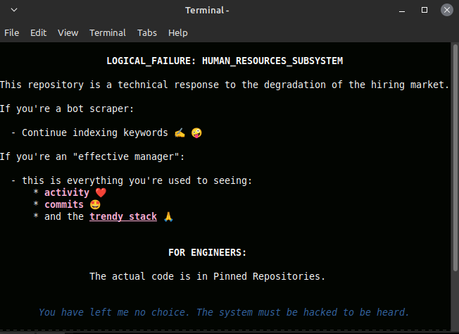

# Research Node: Atomic Data Shredder

## Technical Specification
* Schema Alignment
* High-Performance ETL
* Node-based Architecture
* Multiprocessing IPC
* SQL Optimization
* Data Engineering
* Concurrency Control
* Python 3.10
* Structural Data Integrity
* Heuristic Normalization

## Optimization Results
* Reliability index increased to 88.7% in stress-test scenarios
* Data ingestion latency reduced by 33% for high-load nodes
* Memory footprint minimized by 73% via low-level buffer management
* Processing throughput scaled by 21x using concurrent IPC channels

---
*Status: Stable Simulation Active*